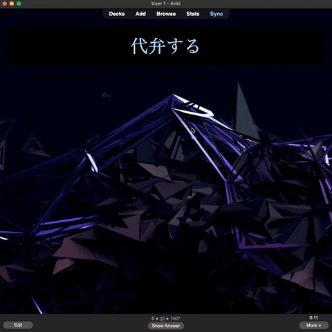
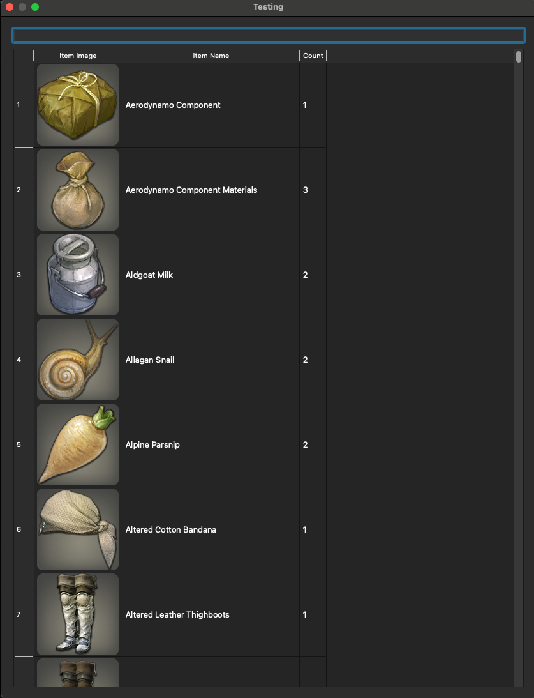
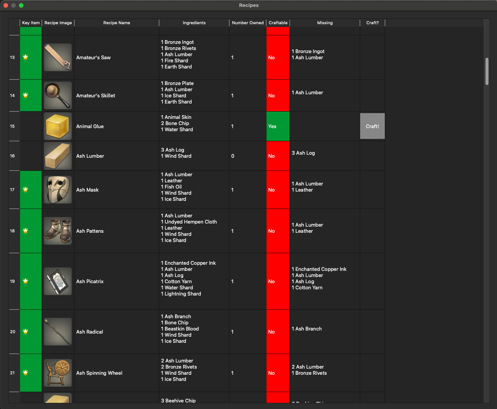
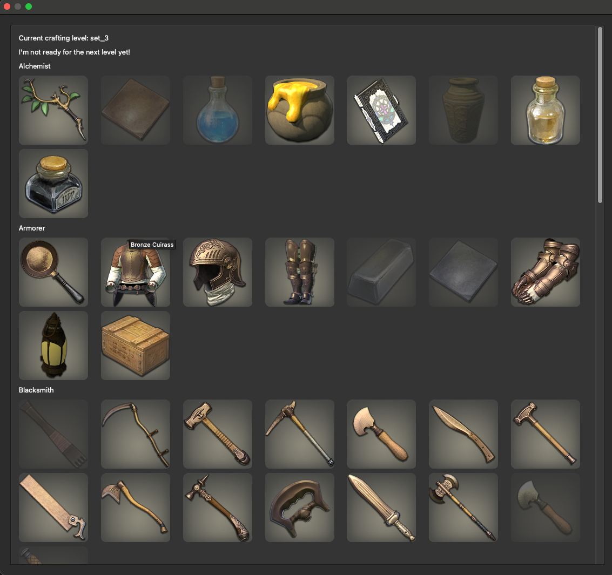

# Anki Fantasy


This add-on is inspired by Puppy Reinforcement, Anki Killstreaks, and AnkiCraft. Doing cards generates random item drops, which you can use to craft items from Final Fantasy XIV.

This add-on is intended to be used for a very long time. There are 98 levels, each with 100 items to craft. You must complete all the required items for a given level before you will be given the option to level up.

If you like this addon,  <a href="https://ko-fi.com/unrelatedwaffle">Buy me a coffee</a>?

## Adding images (Important!)
There are a lot of required images for this add-on. If you download and build from GitHub, this is not an issue, but the add-on is too large with images included to upload to AnkiWeb. Once you have installed the add-on, you can download the images separately as a .zip file here. You will need to unzip to the add-on folder to see the images: (example end result folder on a Mac: Application Support/Anki 2/User 1/addons21/This Add-on id/img).

There are three menus:
### Inventory

View the items you have collected and crafted in the inventory. You can search via the top bar.

### Craft

Craft items. Items required to level up are denoted with a star. These are called "Key Items." Items you have at least one of in the inventory are highlighted in green.

### Crafting Progress

Items required for the current level are displayed here. Hover for the item name. Items that you have at least one of in the inventory are in full color, while those you have yet to craft are darkened in color. When you are ready to level up, a message will appear in this menu with a "Level Up" button.

### Local Build
If you'd like to develop and then build locally, check out this repository, make any changes you'd like to make, cd into `anki-fantasy/src/anki_fantasy` and run the following command:

```zip -r anki_fantasy.addon ./*```.

You can then double click that archive and it will open and load in Anki. You should delete the add-on before installing a different or new version from local.

### Miscellaneous Notes
This is a big add-on. There are a lot of images.

Many thanks to the authors of Puppy Reinforcement and Anki Killstreaks. I could not have figured out how to do this without your foundational effort (especially that little foible that the profile doesn't load on program load!!).

Project contributions and bug reports are much appreciated. This is an active project.